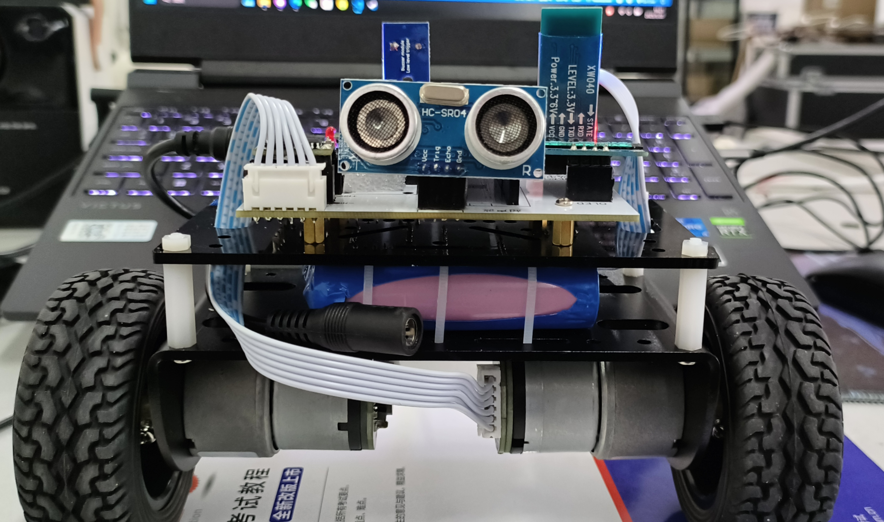
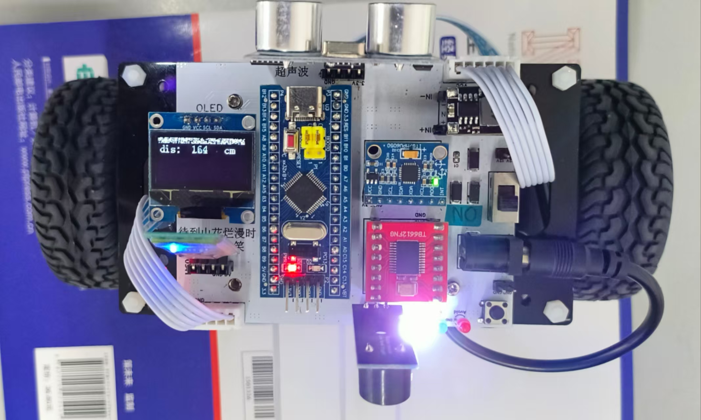
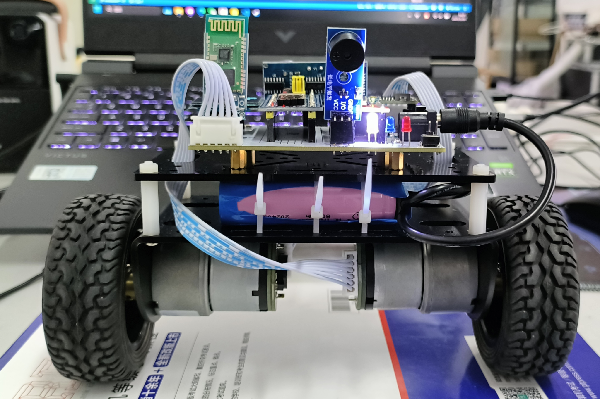
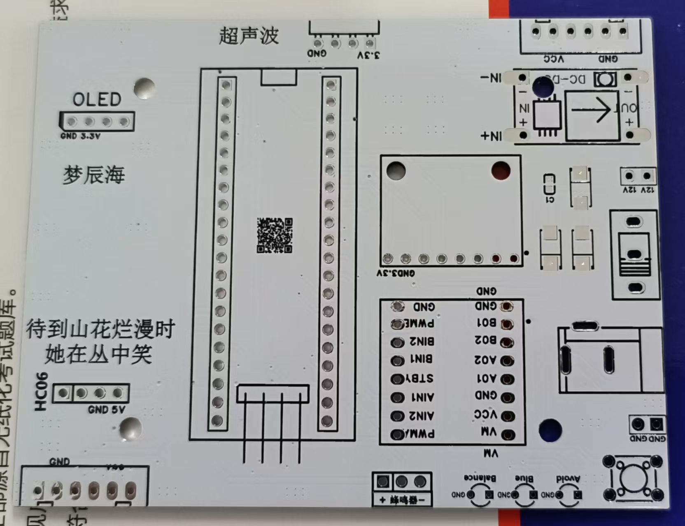

# 基于Stm32f103c8t6的自平衡小车

# [PCB开源地址](https://pro.lceda.cn/editor#id=8368d58da278413fbd0a85511ccdcacd)

# [视频演示](https://www.bilibili.com/video/BV1s4JLzUE3u/?vd_source=990d350c3d7fb93042ed4a36bf2b1c83)
## 电子模块
- **IN5824二极管*3(过压保护)**、10uF贴片电容(滤波)
- SS12D10耐压开关、DC插口
- STM32F103C8T6最小系统板
- MPU6050陀螺仪
- OLED显示屏
- HC-SR04测距模块
- MC520电机
- Tb6612FNG电机驱动
- 蜂鸣器、LED灯*3、6*6*5mm按键
- DC-DC降压模块5V
- 12V锂电池

## 功能说明

- **平衡模式**：点亮白灯表示进入平衡模式，具备较强的抗干扰能力。
- **蓝牙避障模式**：点亮蓝灯表示进入蓝牙模式。在此模式下，可通过手机控制小车移动；当小车距离障碍物小于20cm时，小车停止运动，并触发声光报警；当障碍物远离至50cm以外时，恢复蓝牙控制功能。
- **超声波跟随模式**：点亮红灯表示进入跟随模式。小车会自动跟随前方30cm范围内的物体；若物体距离小于30cm，小车将自动后退，以保持与物体30cm的安全距离。
- **提起检测**：当小车被拿起并持续超过1秒时，小车将自动停止运行。
- **着陆检测**：当小车处于直立状态（Pitch角度在正常范围内），并且放置时间超过1秒时，小车将自动恢复运行。
- **倒地检测**：当小车的Pitch角度超过70度，并且速度超出正常范围时，小车将自动停止运行。